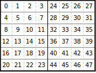

# Data Layouts

In Morello, tensors have associated memory layouts which describe how the data of that
tensor are arranged in the underlying memory buffer. `Layout`s are buffer indexing
expressions---maps from logical coordinates to buffer offsets---paired with some simple
analyses.

Layouts in Morello are expressive. Dimensions can be arbitrarily reordered, yielding
common layouts such as column-major for matrices and NCHW and NHWC for images.
Dimensions can be tiled to produce layouts like
[NCHWc](https://doi.org/10.1109/SC.2018.00069) or even interleaving odd- and
even-indexed values to avoid lane-crossing SIMD instructions. (Layouts do not, however,
allow aliasing; every logical coordinate corresponds to a single buffer offset.)

## Dimension Reordering

Let’s look at row-major layouts, which are usually the default memory layout in other
deep learning frameworks. In the case of matrices (2-dimensional tensors), a row-major
layout is one where each value is at offset \\( Nd_0 + d_1 \\), where \\(N\\), \\(d0\\),
\\(d1\\) are the number of columns in the matrix, row of the value, and column of the
value respectively. A 6x8 matrix with a row-major layout looks like this:


*Integers in cells are offsets into the matrix’s buffer.*

This is called a row-major layout because the row dimension (dimension 0) varies the
slowest as you sequentially scan values in memory.

In Morello, a row-major layout is constructed with `row_major(shp)`. Morello
abuses the term 'row-major’ to refer to any layout where logical dimensions are
laid out sequentially, even if the tensor has more or fewer than 2 dimensions.
As long as all dimensions are greater than size 1, `row_major` is sugar for:

```rust
Layout::new(vec![
  (0, PhysDim::Dynamic),
  (1, PhysDim::Dynamic),
  /* .. */,
  (n - 1, PhysDim::Dynamic)
])
```

The `Layout::new` constructor takes physical dimensions in order from slowest- to
fastest-varying. In this example, `PhysDim::Dynamic` simply means that the whole logical
dimension should be mapped to a single physical dimension. (We’ll discuss this in more
detail later.)

Knowing this, you can see that column-major order is written:

```rust
Layout::new(vec![
    (1, PhysDim::Dynamic),
    (0, PhysDim::Dynamic)
])
```

## Packing

Layouts can also express packing, sometimes called layout tiling (e.g., in
[XLA](https://openxla.org/xla/tiled_layout)). Here’s an example of a packed layout:

```rust
Layout::new(vec![
  (1, PhysDim::Dynamic),
  (0, PhysDim::Dynamic),
  (1, PhysDim::Packed(nz!(4u32))),
])
```

A 6x8 matrix with a packed layout looks like this:



*Integers in cells are offsets into the matrix’s buffer.*

Notice we’ve introduced `PhysDim::Packed`, which is simply a physical dimension with a
fixed size. This differs from `PhysDim::Dynamic`, which has a size inferred from the
tensor shape. (A layout can contain only one `Dynamic` per logical dimension, otherwise
the layout would be ambiguous.)

Notice that, unlike in the previous example, dimension 1 is mentioned twice in the above
example. What does that mean?

Layouts are built compositionally from `PhysDim`s, back to front, until the entire
tensor shape is covered. For each `PhysDim::Dynamic` or `PhysDim::Packed` associated
with a logical dimension \\(i\\),
\\(\alpha_i \left( \lfloor \frac{d_i}{v_i} \rfloor \pmod{p_i} \right)\\)
is added to the buffer indexing expression where \\(\alpha_i\\) is previously covered
volume, \\(v_i\\) is previously covered volume in that logical dimension, and \\(p_i\\)
is the physical dimension size.

Let’s derive the buffer indexing expression for the above example. First, the `Packed`
dimension over dimension 1 yields \\(b_\alpha=d_1 \pmod{4}\\). The `Dynamic` for
dimension 0 adds a term: \\(b_\beta=b_\alpha+4(d_0 \pmod{6})\\). Dimension zero is known
to be in \\(\[0, 5\]\\), so we simplify: \\(b_\beta=b_\alpha+4d_0\\).  The final
`Dynamic` for dimension 1 adds another: \\(b = b_\alpha + b_\beta + 24 \lfloor
\frac{d_1}{4} \rfloor\\).

## Odd-Even Layouts

**TODO:** Describe `PhysDim::OddEven`.
