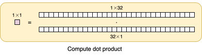
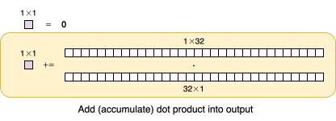
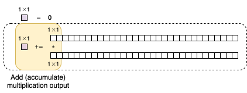

# Hierarchical IR

Morello is built around a hierarchical IR[^ir] where the program and every
sub-program (i.e., program node) has a specification called a *Spec*.

The key idea is that programs over tensors can be built by incrementally substituting
goal Specs with partial programs containing increasingly small and manageable goal
Specs.
Eventually, this process terminates in a complete C program with no nested Specs.

You can also understand this as the dual of a bottom-up process where instructions are
composed via loops and other control structures to form larger and larger programs until
the final program implements the initial goal.

If you've optimized GEMM, then this idea is already familiar to you.
It is seen in, for example, tiling GEMM to minimize the total cost of cache misses.
Each tiling of the tensor dimensions can be seen as a rewrite into a loop where the body
contains a goal Spec with smaller dimensions.

[^ir]: IR is short for *intermediate representation*, which is a program
    representation intended primarily for internal, automated manipulation by a
    compiler. This is in contrast to a programming language, which is a
    representation meant for reading and writing by a programmer.

## Schedule a Dot Product

Let's make this more concrete by implementing a dot product of two 32-value vectors.
We'll begin with a goal Spec, then introduce an accumulating scalar, tile, and choose
an innermost instruction.

Begin by writing out a simplified[^simplified] goal Spec `Matmul(1x32x1)`:

```c
//~#include <stdio.h>
//~
//~int main() {
//~  int output;
//~  int lhs[32], rhs[32];
output = 0;
for (unsigned i = 0; i < 32; i++) {
  output += lhs[i] * rhs[i];
}
//~  return 0;
//~}
```


With Morello, a programmer begins with a partial program containing only the
goal Spec:
```c
// Matmul(1x32x1)
```



The first step is to rewrite that trivially nested Spec into a partial program
which initializes an accumulator and contains a new, accumulating Spec.
```c
output = 0;
// MatmulAccum(1x32x1)
```



Next, that nested Spec is replaced by a loop followed by a version of the
original Spec tiled over the *k* dimension:
```c
output = 0;
for (unsigned i = 0; i < 32; i++) {
  // MatmulAccum(1x1x1)
}
```



Finally, that nested Spec is replaced with a C multiply-accumulate statement:

```c
output = 0;
for (unsigned i = 0; i < 32; i++) {
  output += lhs[i] * rhs[i];
}
```

At this point, no nested Specs remain and the program is complete.

[^simplified]: Morello's actual Specs are more complex, describing much more than
    just the tensor dimensions, but this will do more now.
